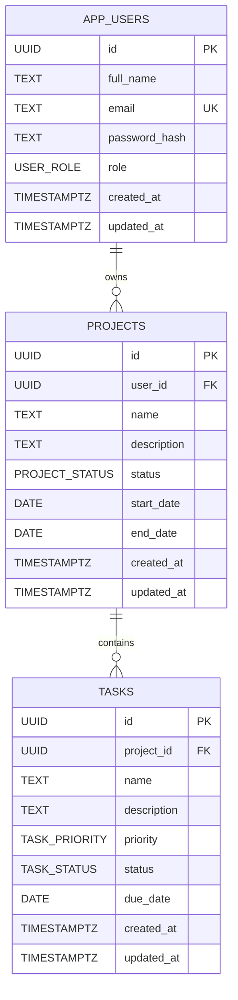

# Entity Relationship Diagram

```mermaid
erDiagram
  APP_USERS ||--o{ PROJECTS : owns
  PROJECTS ||--o{ TASKS : contains
  APP_USERS {
    UUID id PK
    TEXT full_name
    TEXT email UK
    TEXT password_hash
    USER_ROLE role
    TIMESTAMPTZ created_at
    TIMESTAMPTZ updated_at
  }
  PROJECTS {
    UUID id PK
    UUID user_id FK
    TEXT name
    TEXT description
    PROJECT_STATUS status
    DATE start_date
    DATE end_date
    TIMESTAMPTZ created_at
    TIMESTAMPTZ updated_at
  }
  TASKS {
    UUID id PK
    UUID project_id FK
    TEXT name
    TEXT description
    TASK_PRIORITY priority
    TASK_STATUS status
    DATE due_date
    TIMESTAMPTZ created_at
    TIMESTAMPTZ updated_at
  }
```

`projects.user_id → app_users.id` and `tasks.project_id → projects.id` are foreign keys with `ON DELETE CASCADE`.
